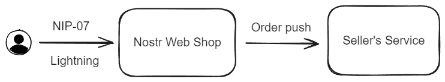

# Nostr Web Shop

A Web Shop base Nostr and Lightning.

## Base Description

1. User login by Nostr (NIP-07) and place orders
2. User Pay orders by Lightning.
3. Nostr Web Shop push orders to seller's servcie.



## API

These APIs are designed to provide queries to third-party services.

all request should contain these header:

- ```nws-seller``` : The seller pubkey. **This public key should be plain pubkey, don't encode it to npubxxxx**.
- ```nws-code``` : The Product CODE.
- ```nws-t``` : The Unix millisecond when request call. like: 1703234742792.
- ```nws-sign``` : The signature gen by you request arguments.

### Signature

When you send a request, it will ask for a argument ```nws-sign```, you can gen it like this:

1. Gen a string ```str``` like this ```nws-seller + nws-code + nws-t + method + requestPath + body + PushKey```.
2. Use ```md5``` method to gen ```nws-sign```, like ```md5(str)```

argument description:

- ```method```, The http method whick should use upper case, like: GET, POST.
- ```body```, If the http request don't have a body, just use an empty string.
- ```PushKey```, a key had input after you save a product.

### API list

#### Order List

Query the order list. Orders will order by paid time.

**Url** : ```/api/order/list```

**Method** : ```GET```

**Argument** :

| Name  | Required | description                             |
|-------|----------|-----------------------------------------|
| since | true     | Query the order since this millisecond. |

**Response** :

```json
{
  "code":100,
  "msg":"OK",
  "data":[
    {
      "seller":"",
      "code":"",
      "orderProductId":"",
      "buyer":"",
      "num":1,
      "comment":"",
      "paidTime":1
    }
  ]
}
```

#### Get Order

Get an order.

**Url** : ```/api/order/:orderProductId```

**Method** : ```GET```

**Argument** :

| Name           | Required | description   |
|----------------|----------|---------------|
| orderProductId | true     | The order id. |

**Response** :

```json
{
  "code":100,
  "msg":"OK",
  "data":{
    "seller":"",
    "code":"",
    "orderProductId":"",
    "buyer":"",
    "num":1,
    "comment":"",
    "paidTime":1
  }
}
```

## Order Push

After user complete order pay, it will push order to seller's service. The push type include ```Api push``` and ```Front push```.

### Push Arguments

All order will push by HTTP GET method and they will contain these arguments:

| Name           | description                            |
|----------------|----------------------------------------|
| nws-seller     | plain seller pubkey                    |
| nws-code       | product code                           |
| nws-t          | The Unix millisecond when request call |
| nws-sign       | The signature gen by arguments         |
| orderProductId | order id                               |
| buyer          | plain buyer pubkey                     |
| num            | product num                            |
| comment        | the comment with order                 |
| paidTime       | the order paid time Unix millisecond   |

### Signature

When you get an order push, you must check the nws-sign, the nsg-sign argument was gen by these step:

1. Gen a text ```str``` like these, ```nws-seller + nws-code + nws-t + buyer + comment + num + orderProductId + paidTime + PushKey```. The ```str``` also can gen by like this ```nws-seller + nws-code + nws-t + orderArguments + PushKey```. The ```orderArguments``` is all order arguments sorted by names and joined by values.
2. Use ```md5``` method to gen ```nws-sign```, like ```md5(str)```

### Api push

Api push will push the order info backgroundly to seller's service.

### Front push

The Front push will jump directly to the seller's service address after the user completes the payment. This method is suitable for services that require you to fill in a form or perform some operations after payment.

